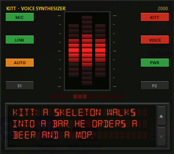

# Mouthpiece

A Windows tray app for talking to a [Hermes](https://github.com/NousResearch/hermes-agent) bot out loud.
It joins the bot's LiveKit room natively (no browser), owns your mic and speakers, and gives you a
full-duplex conversation: you talk, the bot answers in its own voice, you can cut in. While you're in
the room a small stage shows the bot's avatar with live captions. Several bots can be configured and
picked from the tray or a Stream Deck button.



## What you need

- **Windows 10/11** with a microphone and speakers (or a headset).
- **A LiveKit server** you can reach (self-hosted works fine), plus an API key and secret for it.
- **A Hermes bot running the `livekit` platform** (`pip install hermes-livekit` on the Hermes box) so it
  waits in a LiveKit room, transcribes what it hears, and speaks its replies with the TTS provider you
  configured in Hermes. One bot = one room.

## Install

1. Download `Mouthpiece.zip` from the releases page, unzip it anywhere, run `Mouthpiece.exe`.
2. The first run opens a setup window:
   - **Token source.** Choose *LiveKit API key + secret*. Paste your LiveKit URL (`ws://host:7880` or
     `wss://…`), the API key, and the secret. Tokens are signed on your PC; nothing else is contacted.
     (*Mint service* is for people who run a separate token-minting endpoint; you can ignore it.)
   - **Your identity and name.** The participant id and display name the bot sees.
   - **First bot.** A short id, a display name, and the LiveKit **room** the bot's gateway waits in.
3. A tray icon appears. Right-click it and choose **Join**.

Your settings live in `%APPDATA%\Mouthpiece\config.json`; the log is next to it. **Settings…** in the tray
reopens the setup window.

## Set up the bot on the Hermes side

In the Hermes profile you want to talk to, enable the LiveKit platform and give it a room:

```yaml
platforms:
  livekit:
    enabled: true
    extra:
      url: ${LIVEKIT_URL}
      api_key: ${LIVEKIT_API_KEY}
      api_secret: ${LIVEKIT_API_SECRET}
      room: mybot            # the room you enter in Mouthpiece
      agent_name: MyBot      # the name Mouthpiece shows for the bot
      allow_all_users: true
```

Set `tts.provider` to whatever voice you want the bot to speak with, then run that profile's gateway
(`hermes -p <profile> gateway run`). The gateway only joins its room when a human shows up and leaves
when the room empties, so idle bots cost nothing.

Recommended profile settings for a voice body, and why:

| Setting | Why |
|---|---|
| `display.tool_progress: off`, `display.busy_ack_detail: false` | keeps "running tool…" pings out of the spoken room |
| `tools.tool_search.defer: [...defaults..., text_to_speech]` | stops the model from calling the TTS tool itself, which makes it speak twice |
| a short "you are on a voice call" block in the SOUL | first sentence short, no markdown, no lists |

`lab/hermes/` has the scripts used to build our bodies, including two small gateway patches that
improve streaming (captions arrive with the audio; long replies aren't cut off). They're optional.

## Adding more bots

Each bot is one entry in the `bots` list of `config.json`:

```json
{"id": "mybot", "display": "MyBot", "room": "mybot", "accent": "#2B6CFF", "skin": "kitt"}
```

| Field | Meaning |
|---|---|
| `id` | short handle, used by the Stream Deck trigger (`/switch/<id>`) and the tray |
| `display` | name shown in the tray, on the stage, and in captions |
| `room` | the LiveKit room this bot's gateway waits in (unique per bot) |
| `accent` | the bot's colour on the stage |
| `skin` | which avatar to draw: `kitt`, `baymax`, or `wheatley` |

Mouthpiece is in one room at a time. Picking another bot leaves the current room and joins the new one.

## Using it

- **Tray menu:** Join / Leave, Mute, Stop talking (while the bot speaks), Allow interruptions, Bot
  picker, Microphone and Speaker device pickers, Settings…, Open log.
- **Hotkeys** (configurable under `hotkeys` in the config): `ctrl+alt+m` mute, `ctrl+alt+j` join or
  leave, `ctrl+alt+s` stop the bot talking.
- **Echo guard.** By default your mic is silenced toward the bot while it is speaking, so it can't hear
  itself through your speakers. Turn on *Allow interruptions* in the tray to disable that and rely on
  echo cancellation instead; that gives you voice barge-in but needs a headset or a clean mic path.
- **Stage.** Appears when you join, disappears when you leave. Drag it anywhere; the position is
  remembered. The `kitt` skin is a dashboard panel with an LED voice cluster and an LCD transcript.
  The `baymax` and `wheatley` skins are floating characters: hover for the controls and the transcript
  strip, click the body to pin the strip open.

## Stream Deck

Mouthpiece listens on `http://127.0.0.1:18760` (loopback only, GET or POST). In the Stream Deck app use
**System → Website** with *Access in background* and one of:

| URL | Does |
|---|---|
| `/switch/<bot id>` | one button per bot: join, or leave if already in that room |
| `/join/<bot id>` · `/leave` · `/toggle` | explicit join, leave, or join/leave the current bot |
| `/mute` · `/unmute` · `/toggle-mute` | mic |
| `/stop` | stop the bot talking |
| `/status` | JSON state |

Change the port with `trigger_port` in the config.

## Run from source

```
git clone https://github.com/drewdah/mouthpiece
cd mouthpiece
py -3.13 -m venv .venv
.venv\Scripts\python -m pip install -r requirements.txt
Mouthpiece.cmd                          # tray (pythonw, no console) – opens setup on first run
.venv\Scripts\python spike.py           # terminal debug: join, print events, Enter to leave
```

A `config.json` next to the source takes precedence over the one in AppData, so a checkout can keep
its own settings. To build the exe:

```
.venv\Scripts\python -m pip install -r requirements-build.txt
.\build.ps1                              # dist\Mouthpiece\Mouthpiece.exe + dist\Mouthpiece.zip
```

## Writing a skin

A skin is a Python class in `mouthpiece/stage/` registered in the `SKINS` table in `window.py`. It gets
a snapshot every frame (state, speaker level, mic level, muted, captions, bot colour) and draws on a
Tk canvas. `kitt.py` is a panel skin; `entity.py` is the base for floating characters, with
`baymax.py` and `wheatley.py` as examples that only implement `step_body` and `paint_body`.

## Layout

- `mouthpiece/config.py` — config file, locations, validation
- `mouthpiece/mint.py` — LiveKit room tokens (local signing, or a mint service)
- `mouthpiece/audio.py` — mic and speakers ⇄ LiveKit frames, echo cancellation, echo guard
- `mouthpiece/session.py` — room lifecycle, the bot's events, captions
- `mouthpiece/tray.py` — tray UI · `hotkeys.py` · `trigger.py` · `setup_ui.py`
- `mouthpiece/stage/` — the stage window and skins
- `lab/` — Hermes-side scripts and reference material

## License

MIT. The bundled DSEG font is by keshikan under the SIL Open Font License (see `mouthpiece/stage/fonts`).
